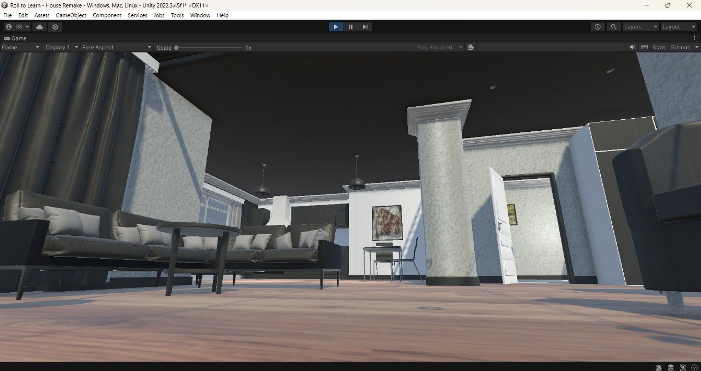
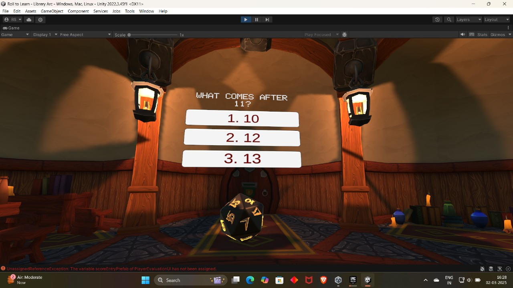
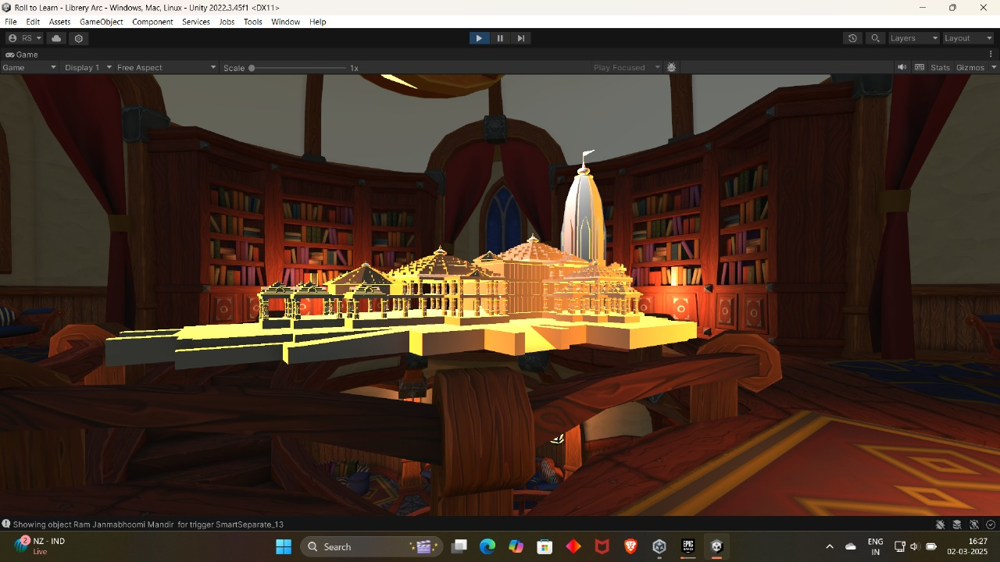
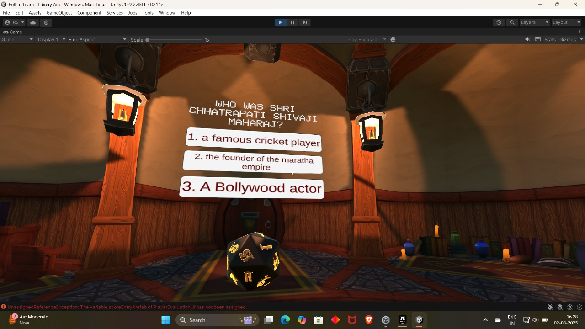
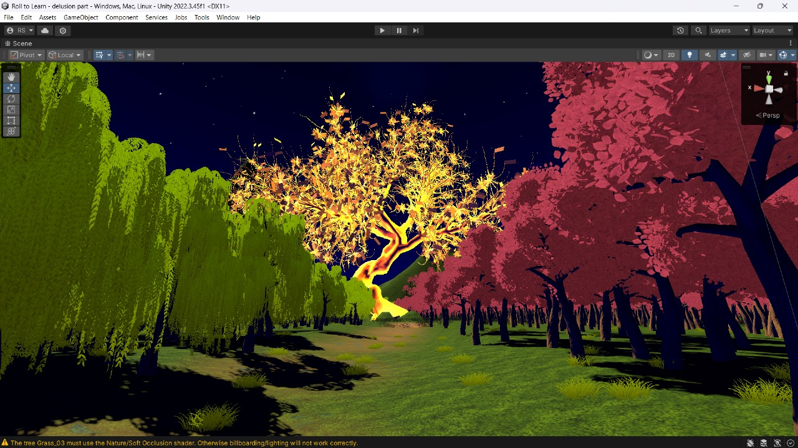
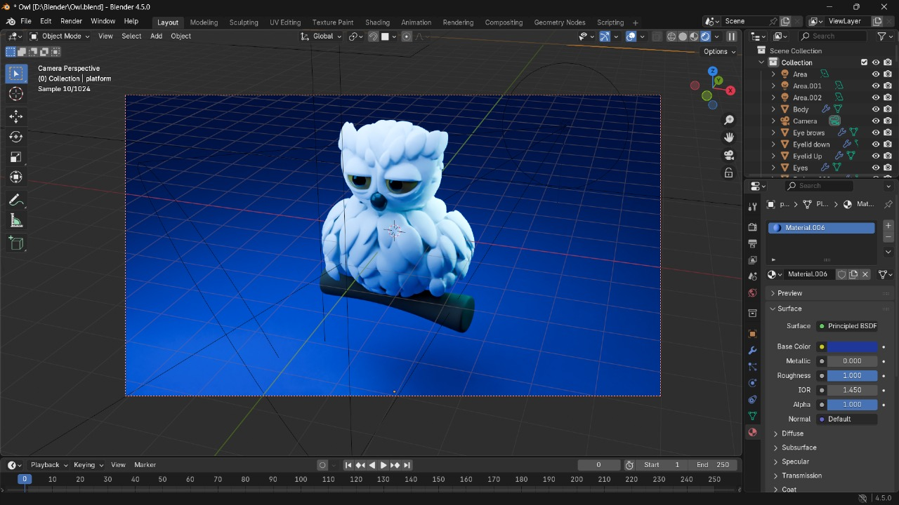

# Roll To Learn 🎲: An Immersive 3D Educational Adventure

[](https://unity.com/)
[](https://docs.microsoft.com/en-us/dotnet/csharp/)

**Roll To Learn** is an innovative 3D educational game developed as a major project at Parul University. It's designed to make learning an engaging adventure by blending real-world exploration with a dynamic, multimedia-rich quizzing system.Unlike traditional educational games that rely on repetitive formats, this project immerses players in a visually compelling environment where knowledge acquisition is driven by curiosity and discovery.

---

## 📜 Table of Contents

* [Problem Statement](#-problem-statement)
* [Key Features](#-key-features)
* [Project Gallery](#-project-gallery)
* [Tech Stack & Tools](#-tech-stack--tools)
* [System Architecture](#-system-architecture)
* [Getting Started](#-getting-started)
* [Future Scope](#-future-scope)
* [Project Team](#-project-team)
* [Acknowledgments](#-acknowledgments)
* [License](#-license)

---

### 🎯 Problem Statement

Many educational games fail to captivate players due to simplistic, repetitive question-answer formats. They often lack immersive storytelling, real-world context, and a rewarding sense of progression, limiting their educational impact and entertainment value. **Roll To Learn** bridges this gap by creating an interactive experience where learning is a fun and impactful part of the gameplay, not just an objective.

---

### ✨ Key Features

* 🌍 **3D Exploration:** Navigate through beautifully crafted, real-world-inspired environments like historical sites, libraries, and mysterious caves.
* 🎲 **Dynamic Dice Mechanic:** A core gameplay loop where rolling a dice triggers engaging, visually-based questions, adding an element of chance and excitement.
* 🧠 **Diverse Question Framework:** Engages players with classic single-answer multiple-choice questions designed to test and reinforce specific knowledge across **STEAM** and **Cultural History**. This focused approach ensures a clear learning outcome for each challenge.
* 📈 **IQ Point & Progression System:** Earn IQ points for correct answers to unlock new levels and challenges, providing a clear sense of achievement and motivation.
* multimedia **Multimedia Integration:** Questions are presented using a rich combination of audio, video clips, and captivating visuals, enhancing comprehension and retention.
* 💡 **Constructive Feedback:** Incorrect answers are met with helpful feedback and hints, turning mistakes into learning opportunities.

---

### 📸 Project Gallery

Here are some snapshots of the game environment and user interface from the Unity Editor.

| Game Room & Cultural Artifacts                               | Question UI & Dice Mechanic                             |
| ------------------------------------------------------------ | ------------------------------------------------------- |
|  |  |
| *A view of one of the game's interactive rooms.*  | *Example of a multiple-choice question.*  |
|  |  |
| *A cultural monument rendered as a hologram.*  | *A history-based question about a famous figure.*  |

| Guide Character & Fantasy Environment                        | Cutscene & 3D Modeling in Blender                     |
| ------------------------------------------------------------ | ----------------------------------------------------- |
|  |  |
| *The magical Golden Tree in a special game level.*  | *The guide character, Luna, as seen in Blender.*  |


---

### 💻 Tech Stack & Tools

This project was built using a combination of powerful and industry-standard tools:

* **Game Engine:** **Unity (2022.3 LTS)** - Used as the core platform to build the 3D world, manage assets, and script game logic.
* **Programming Language:** **C#** - The primary language for scripting all game mechanics, UI interactions, and logic within Unity.
* **3D Modeling & Animation:** **Blender** - Employed for creating custom 3D models and animations for environments and game assets.
* **Video Editing:** **KineMaster** - Utilized to create and edit the short, engaging video clips used for multimedia questions.

---

### 🏗️ System Architecture

The game's flow is designed to be intuitive and engaging. The following diagrams from our report illustrate the core user interactions and system logic.

**Use Case Diagram**
This diagram shows the main actions a player can perform within the "Roll to learn System."


**UML Activity Diagram**
This diagram visualizes the flow of the game from start to level completion, including the question-answer loop and the IQ point evaluation logic.


---

### 🚀 Getting Started

To run this project locally, you will need the following:

**Prerequisites:**
* **Unity Hub** 
* **Unity Editor version 2022.3 LTS or a compatible LTS version** 
* **Git**

**Installation:**

1.  Clone the repository to your local machine:
    ```sh
    git clone [https://github.com/YOUR_USERNAME/roll-to-learn.git](https://github.com/YOUR_USERNAME/roll-to-learn.git)
    ```
2.  Open **Unity Hub** and click on "Add project from disk."
3.  Navigate to the cloned repository folder and select it.
4.  The project will now appear in your Unity Hub. Open it with the correct Unity Editor version.
5.  Once the project is loaded, locate the main scene file in the `Assets/Scenes` folder and open it.
6.  Press the **Play** button in the Unity Editor to start the game.

**Recommended Hardware:**
* **Processor:** Intel Core i5-11400 / AMD Ryzen 5 4600G 
* **Memory (RAM):** 12 GB or more 
* **Graphics Card:** NVIDIA RTX 3050 (4 GB VRAM) / AMD Radeon RX 560 (4 GB VRAM) 

---

### 🔭 Future Scope

We have identified several exciting avenues for future development to expand the game's impact and capabilities:

* **Content Expansion:** Adding new subjects like geography and environmental science, and incorporating more diverse cultural histories.
* **Multiplayer Mode:** Introducing collaborative and competitive modes for enhanced social engagement.
* **Adaptive Difficulty:** Implementing a system that adjusts question difficulty based on player performance.
* **Augmented Reality (AR) Integration:** Exploring AR features to overlay game elements onto the real world.
* **Educator Tools:** Developing a backend analytics system and a companion tool for teachers to customize content for classroom use.

---

### 🧑‍💻 Project Team

This project was a collaborative effort by:

* **Patil Dhruv Prakash** [2303051457005] 
* **Sharma Rushilkumar** [2303051457007] 
* **Singh Khushi** [2303051057078] 

---

### 🙏 Acknowledgments

We would like to express our sincere gratitude to our project guide, **Mr. Ajay Solanki** (Assistant Professor, CSE, PIT), for his continuous guidance and support throughout the development of this project. We also thank the Department of Computer Science & Engineering and Parul University for providing us with this opportunity.
